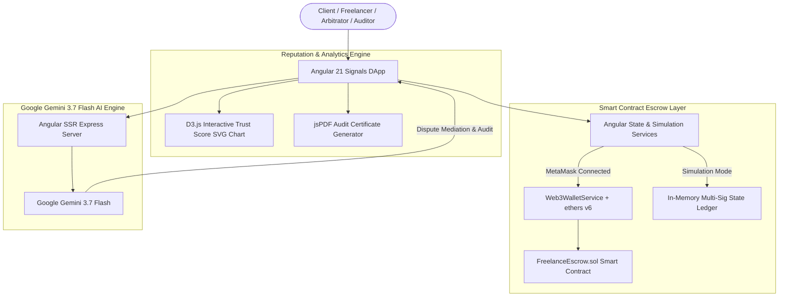

# 🤝 Smart Contract-Based Freelance Payment Escrow System (TrustEscrow)

[](https://soliditylang.org/)
[](https://angular.dev/)
[](https://www.typescriptlang.org/)
[](https://tailwindcss.com/)
[](https://d3js.org/)
[](https://hardhat.org/)
[](https://ai.google.dev/)
[](https://opensource.org/licenses/MIT)

> A trust-minimized, milestone-driven freelance payment escrow DApp on Ethereum where clients fund projects, payments are released upon milestone deliverable approvals, refunds are guaranteed before work starts, and disputes are resolved by an on-chain arbitrator — integrated with D3.js reputation telemetry and Google Gemini 3.7 Flash AI dispute copilot.

---

## 🌟 Key Features

* **🛡️ Trust-Minimized Contract Escrow**: Client ETH deposits are locked directly into the `FreelanceEscrow.sol` smart contract balance. Neither client, freelancer, nor arbitrator can withdraw funds outside of defined milestone state transitions.
* **🔒 Reentrancy Protection & CEI Pattern**: All ETH transfers strictly enforce the Checks-Effects-Interactions (CEI) programming pattern alongside a non-reentrancy guard (`nonReentrant`).
* **📌 Multi-Milestone Granular Release**: Payments are released milestone-by-milestone upon client approval (`approveMilestoneAndRelease`), eliminating single all-or-nothing payout risks.
* **↩️ Pre-Work Cancellation Refund**: Clients can cancel escrow before work starts (`cancelAndRefund`) to receive a 100% ETH refund directly from the smart contract.
* **⚖️ Binding Arbitrator Dispute Resolution**: In contested milestone cases, designated arbitrators execute binding on-chain split rulings (e.g., 70% Client refund / 30% Freelancer payout) with automated ETH distribution.
* **⭐ ERC-5192 Soulbound Reputation & D3.js Charts**: Non-transferable Soulbound Token (SBT) badges and interactive D3.js historical trust score trend charts.
* **📄 Client-Side PDF Audit Report Exporter**: One-click jsPDF generation of cryptographic milestone audit certificates.
* **🤖 Google Gemini 3.7 Flash AI Copilot**:
  * **AI Smart Contract & Milestone Risk Inspector**: Analyzes contract terms for ambiguous deliverables and flags scope risks.
  * **AI Dispute Mediator Copilot**: Evaluates client vs. freelancer evidence and recommends fair percentage split rulings.
  * **AI Deliverable Evaluator**: Scores submitted code and design deliverables against milestone specifications.

---

## 🏗️ System Architecture



---

## 💻 Tech Stack

| Layer | Technology |
|---|---|
| **Smart Contracts** | Solidity `0.8.20`, Hardhat `2.22`, ethers.js `v6` |
| **Frontend** | Angular `21`, TypeScript `5.9`, Tailwind CSS `v4`, Material Icons |
| **Data Viz** | D3.js `v7` SVG interactive line graphs with area gradients |
| **Document Export** | jsPDF `v4` client-side audit certificate engine |
| **Backend / SSR** | Angular SSR, Express `v5`, Node.js |
| **AI Engine** | Google Gemini `3.7 Flash` (`@google/genai`) |

---

## 🚀 Getting Started

### Prerequisites
* [Node.js](https://nodejs.org/) (v18 or higher)
* [MetaMask](https://metamask.io/) browser extension (optional for live Web3 testing)

### Installation

1. **Clone the repository**:
   ```bash
   git clone https://github.com/abdr492/Smart-Contract-Based-Freelance-Payment-Escrow-System.git
   cd Smart-Contract-Based-Freelance-Payment-Escrow-System
   ```

2. **Install dependencies**:
   ```bash
   npm install
   ```

3. **Configure Environment**:
   ```bash
   cp .env.example .env
   # Add your GEMINI_API_KEY to .env
   ```

4. **Compile Smart Contracts**:
   ```bash
   npm run hardhat:compile
   ```

5. **Run Automated Tests (20/20)**:
   ```bash
   npm run hardhat:test
   ```

6. **Deploy Contract & Seed Sample Escrows**:
   ```bash
   npm run hardhat:deploy
   ```

7. **Start the Application**:
   ```bash
   npm start
   ```
   Open [http://localhost:4200](http://localhost:4200) in your browser.

---

## ⚠️ Disclaimer

This project is developed solely for educational, academic, and blockchain course research purposes. All client names, freelancer profiles, milestone deliverables, and wallet addresses in this platform are **synthetic dummy data** containing **NO real financial liabilities**.

---

## 👨‍💻 Author

**Abdulrahman Anas**
* 💼 LinkedIn: [abdulrahman-anas](https://www.linkedin.com/in/abdulrahman-anas)
* 🐙 GitHub: [@abdr492](https://github.com/abdr492)

---

## 📄 License

This project is licensed under the MIT License — see the [LICENSE](LICENSE) file for details.
